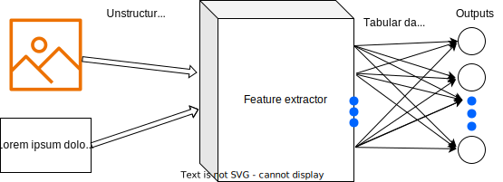

# Heuristic weight initialization for transfer learning in classification problems



Code and results for the paper "Heuristic weight initialization for transfer learning in classification problems".

## Setup

First, clone this repository with its submodules

Then, install conda


```
curl -sL \
  "https://repo.anaconda.com/miniconda/Miniconda3-latest-Linux-x86_64.sh" > \
  "Miniconda3.sh"
bash Miniconda3.sh -b -p
rm Miniconda3.sh
source $HOME/miniconda3/bin/activate
conda init zsh
```

Finally, create a new environment from a conda-yaml file

```
conda env create -f environment.yml
```

## Data preparation

All datasets used in the paper are publicly available, so please download them as files in folders to indicate of their classes.

## Run experiments

You can replicate our experiments by running the following commands: for image classification

```
python3 ./exp_images.py --tr-folder "path/to/dataset" --te-folder "path/to/dataset" --seed 42 --epochs 5 --output "cifar10.txt" --model efficientnet --w-type nikolay --w-threshold 0 --optimizer Adam # --only-sign
```

for text classification

```
python3 ./exp_texts.py --tr-folder "path/to/dataset" --seed 42 --epochs 5 --output "gossipcop.txt" --model small_bert --w-type nikolay --w-threshold 0 # --only-sign
```

and for audio classification

```
python3 ./exp_audio.py --tr-folder "path/to/dataset"  --te-folder "path/to/dataset" --seed 42 --epochs 5 --output "mini_speech_commands.txt" --model efficientnet --w-type nikolay --w-threshold 0 # --only-sign
```

where

* `--tr-folder` - training set folder, positional parameters
* `--te-folder` - test set folder, if not provided, then the training set is divided into 80% and 20% subsets for training and testing.
* `--seed` - used when `--te-folder` is not provided to split the data
* `--output` - output files name stores results in a file in folder 'res-logs'
* `--model` - model name should be one of them: 'mobilenet_v3', 'efficientnet', 'inception_v3', 'resnet_50', 'vision_transformer', 'convnext', 'mlp-mixer' for images and audios; 'small_bert', 'bert', 'albert', 'electra', 'experts', 'talking-heads' for texts
* `--w-type` - measurement type: 'nikolay', 'entropy', 'gini'
* `--w-threshold` - a values to used assign zeros weights those values less than this threshold
* `--only-sign` - used only the class directions without heuristic weights.

## Existing results

All results are located in a folder 'res-logs'. This folder also contains some subfolders for other results such as for larger number of classes.

## Reports

All reports are produced by using `reporting.ipynb` jupyternotebook.